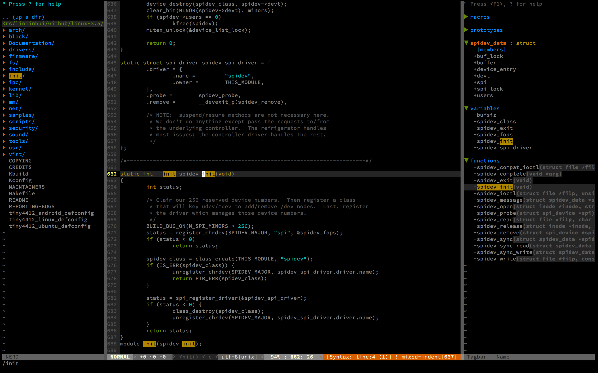

# Oh My Vim

> My Personal Vim Config for Reading [Linux Kernel](http://kernel.org/) Source Code




1. Install [Vim](http://www.vim.org/) & [Git](https://git-scm.com/)

2. Setup [Vundle.vim](https://github.com/VundleVim/Vundle.vim)

    ```
    git clone https://github.com/VundleVim/Vundle.vim.git ~/.vim/bundle/Vundle.vim
    ```

3. clone this [Repo.](https://github.com/mintisan/oh-my-vim) to anywhere you like, such as `HOME`:

    ```
    git clone https://github.com/mintisan/oh-my-vim.git ~/oh-my-vim
    ```

4. Change the directory you just cloned(maybe `cd ~/oh-my-vim`), create symbolic link to `~/.vimrc`

    ```
    # Attension : the source file can't use relative path, must absolutely path
    ln -s $PWD/vimrc ~/.vimrc
    ```
> When you execute `echo $PWD` in shell, you will know what the `$PWD` means. 

5. Download Linue Kernel Source Code, like [2.6.32 Version](https://cdn.kernel.org/pub/linux/kernel/v2.6/longterm/v2.6.32/linux-2.6.32.69.tar.xz), and `tar` it 

    ```
    tar xzf linux-2.6.32.69.tar.xz
    ``` 

6. Enter the directory, and generate `tags` & `cscope.out` for Vim, maybe for a coffee of time XD

    ```
    ctags -R *
    cscope -Rbkq
    ```
> obviously, should install [ctags](http://ctags.sourceforge.net/) and [cscope](http://cscope.sourceforge.net/) firstly

7. Execute `Vim` current directory and then Update Vim Plugin, maybe for another coffee of time XD. It depends on your network solution.

    ```
    :PluginInstall
    ```
or u can use shell script below after you backup your vim config:
```
sh -c "$(curl -fSL https://raw.githubusercontent.com/mintisan/oh-my-vim/master/install.sh)"
```

Use shortcut to jump between files and functions

- use `CTRL+F` to forward page & `CTRL+B` to back page
- use `gg` to top & `shift+g` to bottom(current file)
- use `shift+m` to middle & `shift+l` to bottom & `shift+h` to top(current view)
- use `:number` to any line of file
- use `CTRL+p` to find file in current directory
- use `CTRL+w`+`left/right` to jump with (left-[NERDTree](https://github.com/scrooloose/nerdtree)-windown & center-main-window & right-[tagbar](https://github.com/majutsushi/tagbar)-window)
- `CTRL+]` to locate definition and `CTRL+t` to come back
	- Debian: `sudo apt-get install ctags`
	- Mac: `brew install ctags`
	- Windows: `choco install ctags`
- `:tabnew` to open a new tab;`:tabn` to the next tab; `tabp` to the previous tab
- `Ack {pattern}` or `Ag {pattern} --hidden` to search text patten in current directory
	- Debian: `sudo apt-get install ack-grep`
	- Mac: `brew install ack`
	- Windows: `choco install ack`
- `/` to find specific string you like, and use `n` to next,`N` to previous
- `cs find <x> <xxx>`: use cscope to location files or functions
	- sudo apt-get install cscope
	- brew install cscope
